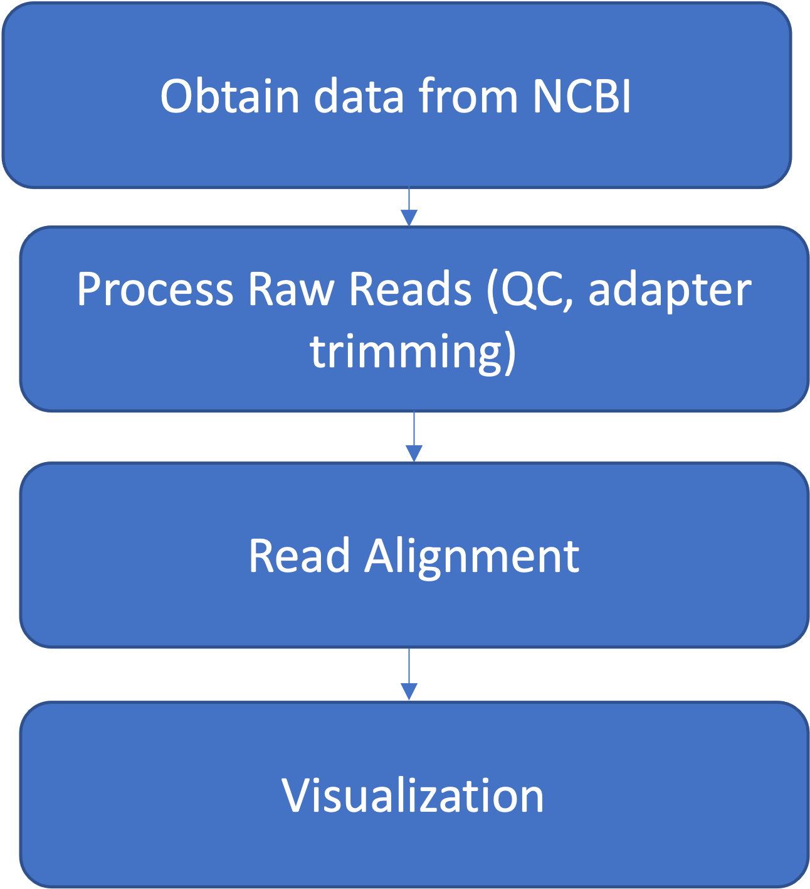

### A Tufts University Research Technology Workshop

## Description
This course is an introduction to NGS data using Galaxy on [Tufts University's Galaxy server](https://galaxy.cluster.tufts.edu). 
For support with this workshop or Galaxy, see our [Galaxy documentation](https://it.tufts.edu/research-technology/bioinformatics/tufts-galaxy) or email TTS Research Technology [tts-research@tufts.edu](mailto:tts-research@tufts.edu)

## Goals

The workshop has the following steps

### Materials Needed
- Chrome web browser
- Account on [Tufts High Performance Compute Cluster](https://it.tufts.edu/research-technology/high-performance-computing)
- [VPN](https://access.tufts.edu/vpn) if accessing the HPC from off campus

## Table of Contents
- [Introduction Slides](../slides/workshop_22Nov21.pdf)
- [Introduction to Galaxy](lessons/00_Galaxy_introduction.md)
- [Next: Introduction and Setup](lessons/01_Introduction_and_Setup.md)
- [Process Raw Reads](lessons/02_Process_raw_reads.md)
- [Read Alignment](lessons/03_Read_alignment.md)

## Acknowledgement
Much of this explanation has been adapted from these sources:
- [Galaxy NGS logistics workshop](https://training.galaxyproject.org/training-material/topics/introduction/tutorials/galaxy-intro-ngs-data-managment/)

