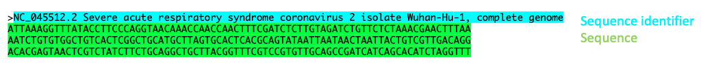

# Intro to NGS data analysis with Galaxy 

The introductory [Slides](../slides/workshop_22Nov21.pdf) give an overview of our goals.

## Step 1: Galaxy Setup

### Log in to Galaxy
- Connect to Tufts Network, either on campus or via VPN

- Visit https://galaxy.cluster.tufts.edu/

- Log in with you cluster username and password

- In another browser window go to course website: 
[https://rbatorsky.github.io/intro-to-galaxy-ngs-sarscov2/](https://rbatorsky.github.io/intro-to-galaxy-ngs-sarscov2/)

- If you have one monitor, here is a suggested screen layout to follow the tutorial

*Suggested screen layout*


### Create a new history
- Click the **+** at the top of the history panel, on the right hand side of the screen
- To rename the history, click on the box **Unnamed History**, type **ngs data workshop**, and press enter


## Step 2: Obtaining our Data
Our dataset is a SARS-CoV-2 Next Generation Sequencing sample. In this section we'll obtain our reference data and our reads and prepare for alignment.

The following steps will walk you through how to run the tools. In each step certain parameters are set. If a parameter option appears on the screen but this tutorial doesn't mention how to set it, leave it at the default. 

### Import the SARS-CoV2 genome and gene annotation from NCBI
- On the left hand side tool panel, click the 


- Click **Paste/Fetch data"**


- Paste the following urls in the grey box:
```
https://ftp.ncbi.nlm.nih.gov/genomes/all/GCF/009/858/895/GCF_009858895.2_ASM985889v3/GCF_009858895.2_ASM985889v3_genomic.fna.gz
https://ftp.ncbi.nlm.nih.gov/genomes/all/GCF/009/858/895/GCF_009858895.2_ASM985889v3/GCF_009858895.2_ASM985889v3_genomic.gff.gz
```

- Click **Start** followed by **Close**

- Two jobs will appear in the History, Grey (pending) -> Orange (running) -> Green (complete).

- Rename the genome and give the file the correct format
-- On the green box for the file ending in fna.gz, click on the **pencil icon**
-- replacing the URL in the name with "genome"
-- clicking **Save**
-- Click on the **Datatypes** tab, and under **New Type** type fasta
-- Click **Change Datatype**


- Rename the genes and give the file the correct format
-- On the green box for the file ending in gff.gz, click on the **pencil icon**
-- Replacing the URL in the name with "genes"
-- clicking **Save**
-- Click on the **Datatypes** tab, and under **New Type** type gff3
-- Click **Change Datatype**


### Fasta Format
Let's have a look at the format for the genome sample 
Fasta format has two parts, a sequence identified preceeded by a ">" symbol, followed by the sequence.


### GFF Format
To preview the GFF file, click on the  **eye** icon.
This format tells us where features such as genes and exons are located in the reference genome.
 on the first sequence file **forward** and look at the fastq reads

The paired end data contains two files, forward and reverse reads for our sample.


The first 4 lines constitute the first sequencing read:
```
@SRR15607266.1 1 length=76
NTTATCTACTTTTATTTCAGCAGCTCGGCAAGGGTTTGTTGATTCAGATGTAGAAACTAAAGATGTTGTTGAATGT
+SRR15607266.1 1 length=76
#8ACCGGGGGGGGGGGGGGGGGGGGGGGGGGGGGGGGGGGGGGGGGGGGGGGGGGGGGGGGGGGGGGGGGGGGGGG
```

1. Sequence identifier
2. Sequence
3. + (optionally lists the sequence identifier again)
4. Quality string

## Base Quality Scores

The symbols we see in the read quality string are an encoding of the quality score:


A quality score is a prediction of the probability of an error in base calling: 


Going back to our read, we can see that for most of our read the quality score is "G" –> "Q" =  38 -> Probability < 1/1000 of an error.


[Next: Process Raw Reads](02_Process_raw_reads.md)

[Previous: Introduction to Galaxy](00_Galaxy_introduction.md)
