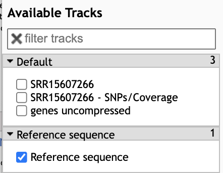

# Read Alignment

Read Alignment is the process of comparing short reads with a reference genome to find the best-matching position. The Burrows-Wheeler Aligner (**BWA**) is a fast and accurate tool for both short and long read alignment, and **JBrowse** is a tool that enables viewing of the alignment results within the Galaxy interface.

## Step 1: BWA alignmnent

The naive method of comparing each read in our dataset to each position in the reference sequence is too slow. Therefore, **BWA** builds an index of the reference sequence, which can be thought of as a lookup table for substrings present in our reference sequence. A short read can be compared to this lookup table in order to find potential matches.For more information on the Burrows-Wheeler Transform, see [Stanford CS262 Lecture](http://web.stanford.edu/class/cs262/presentations/lecture4.pdf)*

BWA builds an index of the reference sequence.

###To run BWA:
- In the Tools panel search bar, type **BWA** and under the **Mapping** section, select **Map with BWA**
- Under **Will you select a reference genome from your history or use a built-in index?** select **Use a genome from history and build index**.
- Under **Use the following dataset as the reference sequence** select **1:genome (as fasta)**
- Under **Select input type** select **Paired fastq collection** 
- Under **Select a paired collection** select **3: Pair-end data (fasterq-dump)**
- Check that your tool is configured as below
- Click **Execute**

Configuration of BWA

### SAM format
BWA produces a file in Sequence Alignment Map (SAM) format or the compressed version BAM.

[Image Source](www.samformat.info)

## Downsample BAM for quicker viewing

Before we view our alignment, we'll downsample our BAM file to contain only a fraction of the original reads. This will be sufficient to view major variants present and confirm that we have sequenced the delta variant. NOTE: An alternative to this would be to increase the **Maximum size of BAM chunks** to 20,000,000 in the **JBrowse** settings in the following section, which will result in much slower loading of the sample.

- In the Tool panel search bar, type "downsample"
- Under **Picard**, select **Downsample SAM/BAM**
- In the Main panel, under **Select SAM/BAM dataset or dataset collection** click the folder icon  and select **15: Map with BWA on collection 3**
- Under **Probability (between 0 and 1) that any given read will be kept** type 0.1 and press enter
- Click **Execute**

## View Downsampled BAM file using JBrowse

JBrowse is a conveniet tool that allows viewing of alignments, genomes and gene annotation within the Galaxy interface.

- In the **Tools** panel search bar, type **JBrowse** and select **JBrowse genome browser**
- Under **Reference genome to display** select **Use a genome from history**
- Under **Select the reference genome** select **1: genome (as fasta)**

- Next we'll add two Track groups, each with an annotation track
  - Under **Track Group** click **Insert Track Group**
  - Under **Annotation Track** click **Insert Annotation Track**
  - First we'll add the GFF track:  Under **Track Type** select **GFF/GFF3/BED Features** and under **GFF/GFF3/BED Track Data** select **genes**.
  - Under **Track Category** type “bam files”
  - Next, well add the BAM track, so again click **Insert Annotation Track**
  - Select track type **BAM Pileups** and under **BAM Track Data** click the folder icon  and select the list **15: Map with BWA on collection 3**
  - Under **Autogenerate SNP Track** click **Yes**

- Finally, run the job:
  - Scroll down and click **Execute**.
  - Once the job is complete (green) click the eye icon to view the data.
  - In the **Available Tracks** panel select **genes**.

- We'll zoom in on one gene **MYC**. To do this, click on the search bar to the left of the **Go** button and type `chr8:127735434-127742951` 
- The bam tracks will show the reads that align to the region for each sample. 
- The color will show whether the read aligns to the + or –strand and grey lines show splice regions where a read spans an intron. 
The gene track at the bottom called **hg38_genes.bed** will show 6 features of EGR1, by clicking on them you will be able to see the different feature types (exon, CDS, start_codon, stop_codon).

[Previous: Process Raw Reads](02_Process_raw_reads.md)
