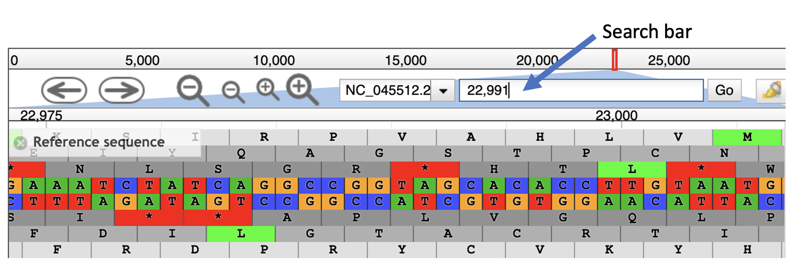

# Read Alignment

Read Alignment is the process of comparing short reads with a reference genome to find the best-matching position. The Burrows-Wheeler Aligner (**BWA**) is a fast and accurate tool for both short and long read alignment, and **JBrowse** is a tool that enables viewing of the alignment results within the Galaxy interface.

## Step 1: BWA alignmnent

The naive method of comparing each read in our dataset to each position in the reference sequence is too slow. Therefore, **BWA** builds an index of the reference sequence, which can be thought of as a lookup table for substrings present in our reference sequence. A short read can be compared to this lookup table in order to find potential matches.For more information on the Burrows-Wheeler Transform, see [Stanford CS262 Lecture](http://web.stanford.edu/class/cs262/presentations/lecture4.pdf)*

BWA builds an index of the reference sequence.

### To run BWA:
- In the Tools panel search bar, type **BWA** and under the **Mapping** section, select **Map with BWA**
- Under **Will you select a reference genome from your history or use a built-in index?** select **Use a genome from history and build index**.
- Under **Use the following dataset as the reference sequence** select **1: genome (as fasta)**
- Under **Select input type** select **Paired fastq collection** 
- Under **Select a paired collection** select **4: Pair-end data (fasterq-dump)**
- Check that your tool is configured as below
- Click **Execute**
- Once the job is completed, you can preview the resulting SAM file by clicking the  icon in the completed **Map with BWA** dataset.

Configuration of BWA

### SAM format
BWA produces a BAM file, which is the compressed binary version of a Sequence Alignment Map (SAM). A SAM file consists of a Header section and an Alignment section. The Header section gives details about the file format and reference sequenced used in alignment, and the Alignment section gives information about each read that was aligned.

Image Source https://www.samformat.info/

## Downsample BAM for quicker viewing

Before we view our alignment, we'll downsample our BAM file to contain only a fraction of the original reads. This will be sufficient to view major variants present and confirm that we have sequenced the delta variant. NOTE: An alternative to this would be to increase the **Maximum size of BAM chunks** to 20,000,000 in the **JBrowse** settings in the following section, which will result in much slower loading of the sample.

- In the Tool panel search bar, type "downsample"
- Under **Picard**, select **Downsample SAM/BAM**
- In the Main panel, under **Select SAM/BAM dataset or dataset collection** click the folder icon  and select **Map with BWA on collection 3**
- Under **Probability (between 0 and 1) that any given read will be kept** type 0.1 and press enter
- Click **Execute**

## View Downsampled BAM file using JBrowse
JBrowse is a convenient tool that allows viewing of alignments, genomes and gene annotation within the Galaxy interface.

### Configure JBrowse viewer
- In the **Tools** panel search bar, type **JBrowse** and select **JBrowse genome browser**
- Under **Reference genome to display** select **Use a genome from history**
- Under **Select the reference genome** select **genome (as fasta)**

- Next we'll add two Track groups, each with an annotation track
  - Under **Track Group** click **Insert Track Group**
  - Under **Annotation Track** click **Insert Annotation Track**
  - First we'll add the GFF track:  Under **Track Type** select **GFF/GFF3/BED Features** and under **GFF/GFF3/BED Track Data** select **genes**.
  - Under **Track Category** type “bam files”
  - Next, well add the BAM track, so again click **Insert Annotation Track**
  - Select track type **BAM Pileups** and under **BAM Track Data** click the folder icon  and select the list **Downsample SAM/BAM on collection 15: downsampled BAM**
  - Under **Autogenerate SNP Track** click **Yes** (SNP = Single Nucleotide Polymorphism. This will enable us to view changes in the sequence data with respect to the reference sequence)
  - Scroll down and click **Execute**.

### Open JBrowse viewer
- Once the job is complete (green) click the  icon on the JBrowse dataset.
- In the **Available Tracks** panel select **genes uncompressed**.

- In the center panel, you will see genome and gene features. We'll click and drag on the Genome coordinates bar in order to zoom in on the S protein region indicated below.

- One can also type exact coordinates into the search bar. After the colon, type 22,991 and hit enter.

- This shows us now a close up of our reference sequence, both forward and reverse, as well as three reading frames.
- This region contains one of the 4 SNP that differentiate the delta from the alpha variant (T478K). To see if this sample contains the SNP, select the two remaining tracks 
  - SRR15607266
  - SRR15607266 - SNPs/Coverage
- We should see one variant represented both in the aligned reads as well as the coverage track.

- The **SRR15607266 - SNPs/Coverage** track plots the number of reads aligned at each position, and additionally shows SNP that are present in >20% of the aligned reads.
- The **SRR15607266** shows each aligned read, coloring forward and reverse reads in blue and red, respectively, and indicating mismatches with the reference genome. Information about individual reads is available by clicking on the read.

- We can check other positions to confirm that we have a delta variant sample:
  -P681R: 23,606 
  -L452R: 22,919

[Previous: Process Raw Reads](02_Process_raw_reads.md)
